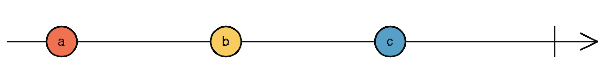

## What is good API?

>Note: Easy, Concise, Powerful.


## How to measure it?

>Note: There is no absolute value. It should be relatively.


## NavKit Navigation API

<section>
    <p class="fragment">buildRouteRequest(Location)</p>
    <p class="fragment">navKit.generateRoute(routeRequest)</p>
    <p class="fragment">navKit.startNavigation()</p>
</section>

>Note: NavKit style such as AutoNavi.


Is it powerfull?


Yes! It's powerful!


But it depends...


What if you don't need Audio, Alert, JunctionView, etc.. but just turn-by-turn info?


   


Monolithic!


Too many hidden info and dependencies!

>Note: Each API is independent but no explicit definition on their relationship and dependencies.


Is it easy to use?


Yes! It's easy!


But it depends...


207 lines!!

```java
final AutoSdkConfiguration autoSdkConfiguration = new AutoSdkConfiguration();
autoSdkConfiguration.put(AutoSdkConfiguration.KEY_ENABLE_DUMP, String.valueOf(isAutoSdkDumpEnabled()));
autoSdkConfiguration.put(AutoSdkConfiguration.KEY_ENABLE_HANDLER_FOR_SIGINT, String.valueOf(true)); // Bug fix of DEN-36396: for GM SDK limitation

mIpTrafficSupported = Feature.State.Active == FeatureCollectionFactory.getFeatureCollection().getFeatureState(Feature.Name.IpTraffic);
mBroadcastTrafficSupported = Feature.State.Active == FeatureCollectionFactory.getFeatureCollection().getFeatureState(Feature.Name.BroadcastTraffic);
autoSdkConfiguration.put(AutoSdkConfiguration.KEY_TRAFFIC_SUPPORT_IP, String.valueOf(mIpTrafficSupported));
autoSdkConfiguration.put(AutoSdkConfiguration.KEY_TRAFFIC_SUPPORT_BROADCAST, String.valueOf(mBroadcastTrafficSupported));
autoSdkConfiguration.put(AutoSdkConfiguration.KEY_DATA_PATH, map_data_path);
Log.i(ArpLogFilter.LOG_MODULE, "MainApplication ipSupported: " + mIpTrafficSupported + " broadcastSupported: " + mBroadcastTrafficSupported);

final Boolean usingInternalStorage = ApplicationContextHelper.getInstance().getBoolean(ApplicationContextHelper.KEY_SDK_STORAGE_PREFER_INTERNAL);
autoSdkConfiguration.put(AutoSdkConfiguration.KEY_SDK_STORAGE_PREFER_INTERNAL, usingInternalStorage.toString());

final Boolean gpsEncrypt = ApplicationContextHelper.getInstance().getBoolean(ApplicationContextHelper.KEY_GPS_ENCRYPT);
autoSdkConfiguration.put(AutoSdkConfiguration.KEY_GPS_ENCRYPT, gpsEncrypt.toString());
...
boolean success = AutoSdkManager.getInstance().init(BaseApplication.this, autoSdkConfiguration, BaseApplication.this, FormatterManager.getInstance(), numberOfSamples, speedThreshold, heartbeatInterval, minEHPE);
```


We can definitely enhance it but let's firstly see something else...


## What does API mean?

> API is a set of subroutine definitions, communication protocols, and tools for building software.
>                               - Wikipedia.org


In general, API is defined to solve particular business problem or provide relationship among business logics.


Relation between a and b
>Note: Build relation between a and b with imperative programming


Imperative programming
```java
int a = 1;
int b = a + 1;
System.out.println("b=" + b);
a = 10;
System.out.println("b=" + b);
```
>Note: The a and b is not built as relationship in this code. It's just a assignment. Let's improve it!


```java
int plusOne(int a) {
    return a + 1;
}
```
>Note: Use method/function to describe the relation between a and b.


b = fa(a) c = fb(b)...




How do we implement it?


## NavKit style

```
startNavigation() = fa(a) {
    ...
    fb(b) {
        ...
        fc(c) {
            ...
            fd(d) {
                ...
                ...
            }
        }
    }
    ...
}
```


It is easy and powerful, but it's short of flexibility.
What if we want to use `fc()` separately, or we don't need function `fd()`?


## Then let's see TaSDK Navigation API

<section>
    <p class="fragment">buildRouteRequest(Location)</p>
    <p class="fragment">dirService.generateRoute(RouteRequest, RouteListener)</p>
    <p class="fragment">navService.startNavigation(Route)</p>
    <p class="fragment">navService.attachAlertService(alertService)</p>
    <p class="fragment">navService.attachAdasService(adasService)</p>
    <p class="fragment">...</p>
</section>


It is bascially equal to:

```
startNavigation() = ...fd(fc(fb(fa(a))))
```


Much more simple, powerful and scalable, but...


>Note: But it is still requiring a lot configs before we can actually use it. Can we simplify it including the Async Programming?


Still too many initializations!!


And so many API combinations!


The API combinations and the timing to use them make things so fragility!

```
PositionService.start/stop x NavigationSession.start/stop = 4! 
```

But only one in those combinations can make it functioning properly.


Below API is a huge scary monster! Think about how many unexpected behaviors if it is not called properly!
```
service.dispose()
```


Ability | NavKit | TASDK
---|---|---
Usibility | 2 stars | 3 stars
Power | Monolithic | Flexsible
Logic complex. | 2^n | 2^n
Async pattern | Callback | Callback

>Note: Is there anyway we can reduce the logic complexity and simplify the async pattern?


## Reactive programming!

> Reactive programming is a declarative programming paradigm concerned with data streams and the propagation of change.
>                               - Wikipedia.org


Reactive programming is a programming paradigm of building relations in things by using asynchronous and data streaming.


<section>
<p>
    <span style="display: inline-block;">startNavigation= ...</span> <span style="display: inline-block;" class="fragment fade-out">fb(</span><span style="display: inline-block;">fa(a)</span><span style="display: inline-block;" class="fragment fade-out">)</span><span style="display: inline-block;" class="fragment fade-left">.fb()</span> <span style="display: inline-block;" class="fragment fade-left">.fc()...</span>
</p>
<p>
    <span style="display: inline-block;" class="fragment fade-right">fa(a) </span> <span style="display: inline-block;" class="fragment fade-left">=> a.fa()</span>
</p>
</section>


Yes, it is cool. But so what?


>Note: Not only how it is behaving so naturally but also huge powerful when working with async.


## CPS

### Continuation-Passing style

```java
void generateRoute(routeRequest, new RouteListener() {
        void onRouteGenerated(route) {
            ...
            startNavigation(route, new NavStatusCallback() {
                    void onNavStatusUpdate(navStatus) {
                        ...
                    }
                }
            )
        }
    }
)
```


Callback hell!!


Rx will save you!


Rx(Reactive extension) is a set of tools allowing imperative languages to operate on sequences of data regardless of whether the data is sync. or async.
Rx is the implementation of reactive programming.


### Rx style


<section>
<p><span style="display: inline-block;" class="fragment highlight-blue">Observable.from</span>(loc)</p>
<p>.<span style="display: inline-block;" class="fragment highlight-blue">map</span>(buildRouteRequest(loc))</p>
<p>.<span style="display: inline-block;" class="fragment highlight-blue">observeOn(Schedulers.computation())</span></p>
<p>.<span style="display: inline-block;" class="fragment highlight-blue">map</span>(dirS.generateRoute(routeRequest))</p>
<p>.<span style="display: inline-block;" class="fragment highlight-blue">map</span>(navS.startNavigation(route))</p>
...
</section>

>Note: It's awesome but can we remove the operators?


### Rx style

<section>
<br/>
<br/>
<br/>
<p style="vertical-align:middle"><span style="display: inline-block;" class="fragment fade-out">dirS</span><span style="display: inline-block;" class="fragment fade-in">loc</span>.  generateRoute  (<span style="display: inline-block;" class="fragment fade-out">loc</span><span style="display: inline-block;" class="fragment fade-in">dirS</span> )</p>
<p class="fragment fade-in-then-semi-out">Do we really care about the direction service?</p>
<p class="fragment fade-up">loc.generateRoute()</p>
</section>


```kotlin
//Sequential style!!
location.buildRouteRequest()
        .generateRoute() //asynchronous
        .startNavigation()
        ...
```

```kotlin
fun suspend RouteRequest.generateRoute(): Route...
```


You can refer [here](https://bitbucket.telenav.com/projects/AUT/repos/java-sdk-common/browse/java_sdk/tasdk-component/src/androidTest/java/com/telenav/arp/sdk/direction/DirectionStrategy.kt?at=refs%2Fheads%2FBlackPanther) to see the full API definitions.


Ability | NavKit | TASDK | Rx
---|---|---|---
Usibility | 2 stars | 3 stars | 5 stars
Power | Monolithic | Flexsible | Flexsible
Logic complex. | 2^n | 2^n | n
Async pattern | Callback | Callback | Directive