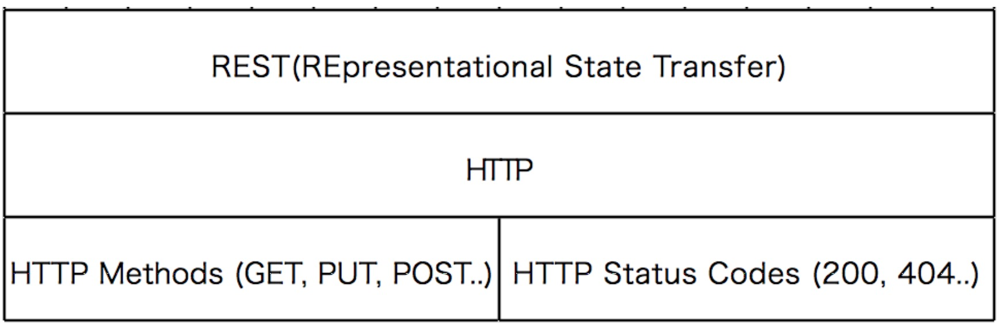

## API GATEWAYS

- Authentication, authorization and security
- Rate Limits
- Fault Tolerance
- Service Aggregation


## WEB SERVICE

- Designed for machine-to-machine (or applicationto-application) interaction
- Should be interoperable - Not platform dependent
- Should allow communication over a network


## WEB SERVICE

- Request and Response
- Message Exchange Format
- XML and JSON


## KEY TERMINOLOGY

- Transport
- HTTP and MQ


## WEB SERVICE GROUPS

- SOAP-based
- REST-styled


SOAP and REST are not really
comparable!

>Note: SOAP is communication format, and Rest is architecture


## SOAP

```java
<getCourseDetailsRequest>
<id>Course1</id>
</getCourseDetailsRequest>
```


## SOAP

```
<SOAP-ENV:Envelope xmlns:SOAP-ENV="http://schemas.xmlsoap.org/soap/envelope/"
<SOAP-ENV:Header/>
<SOAP-ENV:Body>
<ns2:getCourseDetailsResponse xmlns:ns2="http://in28minutes.com/courses"
<ns2:course>
<ns2:id>Course1</ns2:id>
<ns2:name>Spring</ns2:name>
<ns2:description>10 Steps</ns2:description>
</ns2:course>
</ns2:getCourseDetailsResponse>
</SOAP-ENV:Body>
</SOAP-ENV:Envelope>
```


## SOAP

* Format
   * SOAP XML Request
   * XML Response
* Transport
   * SOAP over MQ
   * SOAP over HTTP
* Service Definition
   * WSDL


## REST

REpresentational State Transfer


REST is a style of soware architecture
for distributed hypermedia systems


## MAKE BEST USE OF HTTP




## KEY ABSTRACTION - RESOURCE

* A resource has an URI (Uniform Resource Identifier)
   * /media/tracks/1
   * /media/tracks

* A resource can have different representations
   * XML
   * HTML
   * JSON


## EXAMPLE

* Create a playlist - POST /media/playlists
* Delete a playlist - DELETE /media/playlists/1
* Get all playlists - GET /media/playlists
* Get one playlist  - GET /media/playlists/1


## REST

* Data Exchange Format
   * No Restriction. JSON is popular
* Transport
   * Only HTTP
* Service Definition
   * No Standard. WADL/Swagger/...


## REST VS SOAP

- Restrictions vs Architectural Approach
- Data Exchange Format
- Service Definition
- Transport
- Ease of implementation
