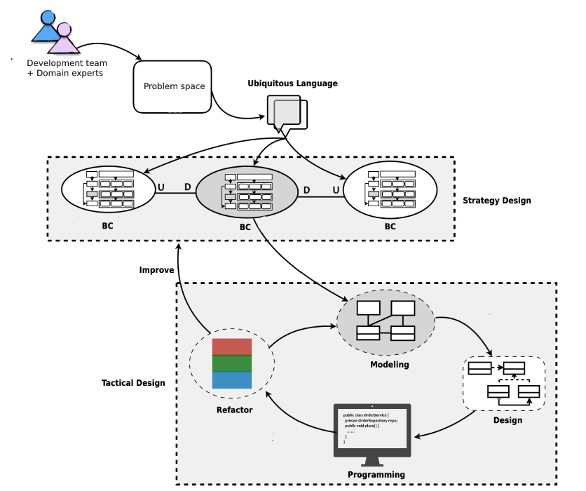
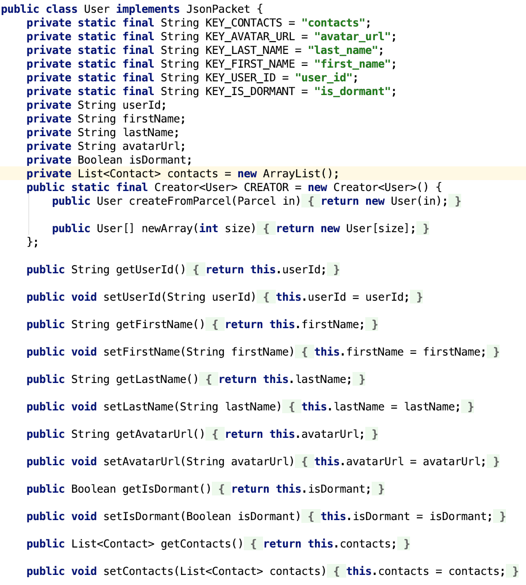
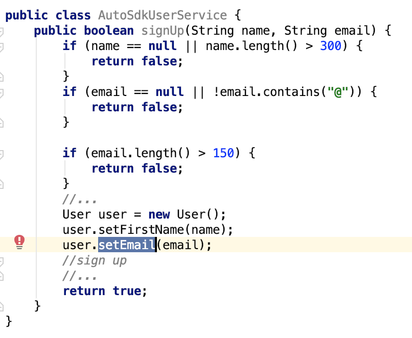
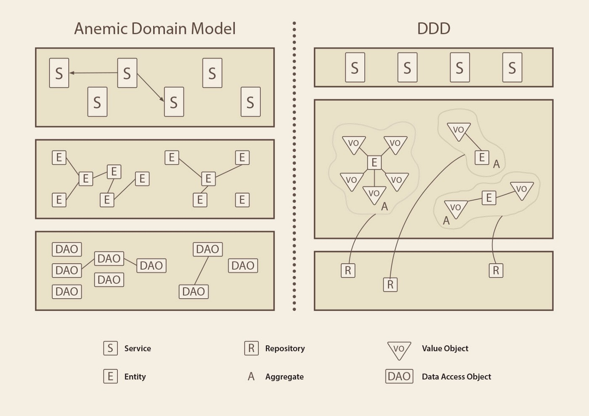
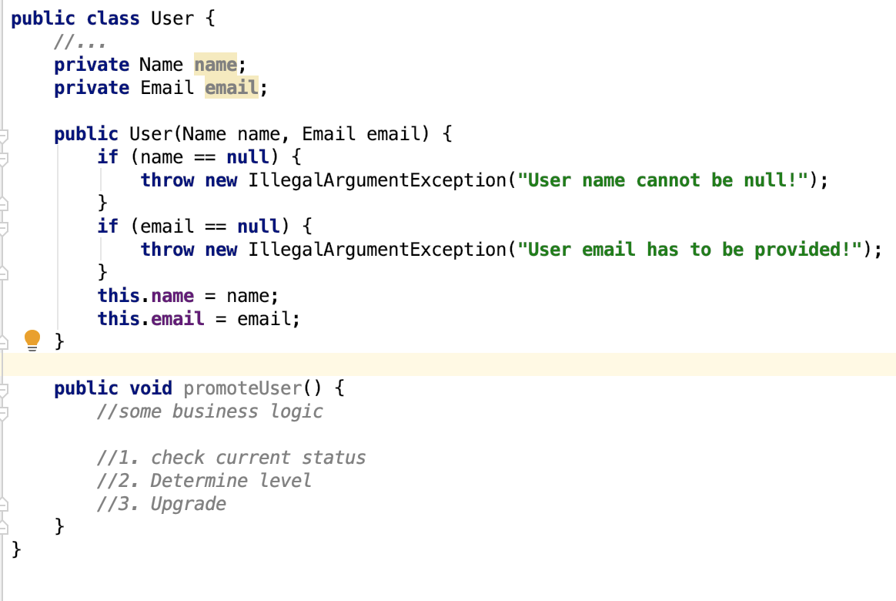

## Agenda

1. DDD 16&17
2. Takeaways
3. One typical anti-pattern of domain model design

## Large scale structure

A pattern of rules or roles and relationships that will span the entire system and that allows some understanding of each part's place in the whole even without detailed knowledge of the part's responsibility.

### Envolving order

Large-scale structure evolve with the application, possibly changing to a completely different type of structure along the way. Don't overconstrain the detailed design and model decisions that must be made with detailed knowledge.

### SYSTEM METAPHOR

When a concrete analogy to the system emerges that captures the imagination of team members and seems to lead thinking in a useful direction, adopt it as a large-scale structure.

1. Firewall
2. Dashboard
3. Core
4. Message broker
5. Circuit breaker
6. ...

### RESPONSIBILITY LAYERS

Layers are partitions of a system in which members of each partition are aware of and are able to use the services of the layers "bellow", but unaware and independent of the layers "above".

* Strict Layered System
* Relaxed Layered System

> whatever layering we decide upon, it must be simple and should have a maximum of 4 or 5 layers.

### Pluggable component framework

Create a framework that allows an independent plugin can be plugged into system easily without changing any code in Central Hub.

1. This is a very difficult pattern to apply.
2. Applications have limited options.
3. Against the pattern of refactoring toward deeper insight

## Bringing the strategy together

Strategic design is composed by 3 principles:

1. Context (Context map, bounded context)
2. Core Domain
3. Large scale structure

### Project assessment

1. Draw a context map
2. Establish or refine the Ubiquitous Language
3. Define what is the core domain
4. Is the technology adequate for DDD/MDD ?
5. Assess the team developers skills to match them to the project complexity
6. Are the developers knowledgeable and engaged in the domain?

### Six Essentials for Strategic Design Decision Making

1. Decisions must reach the entire team.
2. The decision process must absorb feedback.
3. The plan must allow for evolution.
4. Architecture teams must not siphon off all the best and brightest.
5. Strategic design requires minimalism and humility.
6. Objects are specialists; developers are generalists.

## DDD is a Methodology

## Anemic Domain Model

Anemic domain model is nothing more but entities represented by classes containing only data and getter/setter methods. These classes lack of the business logic, which usually is placed in services, managers, utils, helpers etc.

### Anemic Domain Model vs. DDD

Anemic domain model is possibly affected by the Data Driven Design or Procedure Oriented Programming.

### Problems

1. Discoverability of operations
2. Potential duplication
3. Lack of encapsulation

### Refactor into DDD

 

