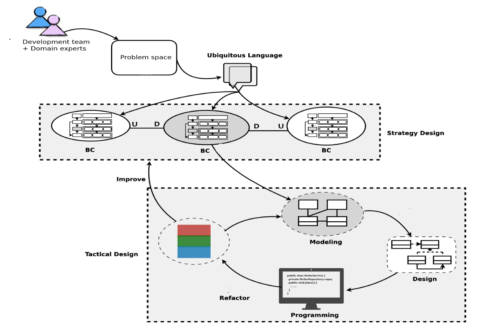
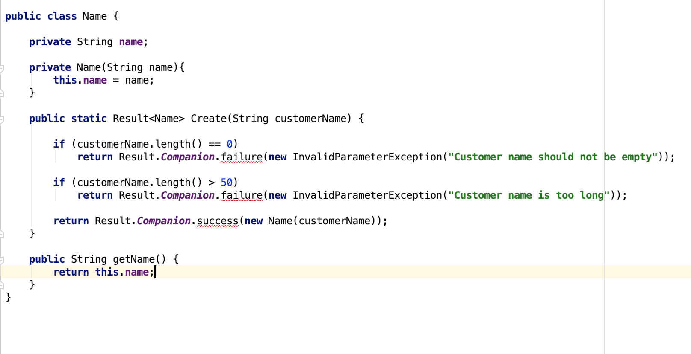

## Agenda

1. DDD 16&17
2. Takeaways
3. One typical anti-pattern of domain model design

## Large scale structure

Rules | Desc
-- | --
Envolving order|Large-scale structure evolve with the application
System metaphor|E.g., Firewall, Dashboard, Message broker, Circuit breaker
Responsibility layers|Paritions of a system
Pluggable component framework|Independent plugin can be plugged into system
Refactoring|Iterative development process

> whatever layering we decide upon, it must be simple and should have a maximum of 4 or 5 layers.

## Bringing the strategy together

Strategic design is composed by 3 principles:

1. Context (Context map, bounded context)
2. Core Domain
3. Large scale structure

### Some Essentials for Strategic Design Decision Making

1. Decisions must reach the entire team.

2. The plan must allow for evolution.

3. Architecture teams must not siphon off all the best and brightest.

## DDD is a Methodology

## Anemic Domain Model

>Note: Anemic domain model is nothing more but entities represented by classes containing only data and getter/setter methods. These classes lack of the business logic, which usually is placed in services, managers, utils, helpers etc.

### Anemic Domain Model vs. DDD

Anemic domain model is possibly affected by the Data Driven Design or Procedure Oriented Programming.

### Problems

1. Discoverability of operations
2. Potential duplication
3. Lack of encapsulation

### Refactor into DDD

 

